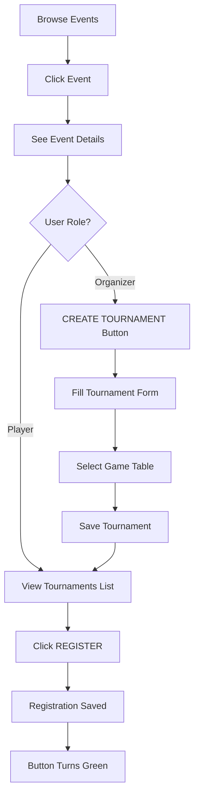

# 🏆 Tournament-within-Event System - Setup Guide

## Overview
Events are now containers that can hold multiple tournaments. Players register for individual tournaments, not events directly.

**Architecture:**
```
EVENT (Helsinki Open Championship)
  ├─ Tournament 1 (Pasila Table #1, 8 players, Elimination)
  ├─ Tournament 2 (Kallio Table #2, 16 players, Swiss)
  └─ Tournament 3 (Finals, 4 players, Round Robin)
```

---

## 🚀 Quick Setup (2 steps)

### Step 1: Update Database Schema
Run this SQL in Supabase SQL Editor:

```sql
-- Copy contents from: database/tournament_fields_update.sql
-- Or run directly:
```

<details>
<summary>Click to see SQL (or just run the file)</summary>

```sql
-- Add organizer_id
ALTER TABLE public.tournament_history 
ADD COLUMN IF NOT EXISTS organizer_id UUID REFERENCES public.players(id) ON DELETE SET NULL;

-- Add tournament_type
ALTER TABLE public.tournament_history 
ADD COLUMN IF NOT EXISTS tournament_type TEXT DEFAULT 'elimination' 
CHECK (tournament_type IN ('elimination', 'swiss', 'round_robin'));

-- Add max_participants
ALTER TABLE public.tournament_history 
ADD COLUMN IF NOT EXISTS max_participants INTEGER DEFAULT 8;

-- Add status
ALTER TABLE public.tournament_history 
ADD COLUMN IF NOT EXISTS status TEXT DEFAULT 'scheduled' 
CHECK (status IN ('scheduled', 'ongoing', 'completed', 'cancelled'));

-- Indexes
CREATE INDEX IF NOT EXISTS idx_tournament_history_organizer_id ON public.tournament_history(organizer_id);
CREATE INDEX IF NOT EXISTS idx_tournament_history_status ON public.tournament_history(status);
CREATE INDEX IF NOT EXISTS idx_tournament_history_tournament_type ON public.tournament_history(tournament_type);
```
</details>

### Step 2: Verify
Run this verification query:
```sql
SELECT column_name, data_type, column_default
FROM information_schema.columns 
WHERE table_name = 'tournament_history' 
AND column_name IN ('organizer_id', 'tournament_type', 'max_participants', 'status', 'event_id')
AND table_schema = 'public'
ORDER BY ordinal_position;
```

Expected result: 5 rows showing the new columns.

---

## ✅ What's Implemented

### Events Page (`events.js`)
- ✅ Create events (name, dates, location, description, image)
- ✅ Browse upcoming events
- ✅ Event detail modal
- ✅ Tournament listing in event modal
- ✅ Create tournament button (organizers only)

### Tournament Creation
- ✅ Tournament creation modal
- ✅ Fields: name, game table, max participants, tournament type
- ✅ Auto-links to event (event_id)
- ✅ Saves to `tournament_history` table

### Tournament Registration
- ✅ Register/Unregister buttons on tournaments
- ✅ Registration stored in `event_registrations`
- ✅ Visual feedback (green button when registered)

---

## 🎮 How to Use

### As Event Organizer:
1. Go to **Events** tab
2. Click **CREATE EVENT**
3. Fill event details (name, dates, location, image)
4. Click **CREATE EVENT**
5. Open the event → Click **CREATE TOURNAMENT**
6. Select game table, set max participants, choose type
7. Repeat to create multiple tournaments in the event

### As Player:
1. Browse **Events** tab
2. Click event to see details
3. See list of tournaments in the event
4. Click **REGISTER** on tournaments you want to join
5. Button turns green when registered
6. Click again to **UNREGISTER**

---

## 📊 Database Schema

### Events Table
```sql
events (
  id, event_name, event_type, start_datetime, end_datetime,
  location, description, image_url, organizer_id, status, is_public
)
```
**Note:** `max_participants` and `game_id` removed from events (per-tournament now)

### Tournament History Table (Updated)
```sql
tournament_history (
  -- Existing fields:
  id, tournament_name, winner_name, second_place_name, third_place_name,
  tournament_id, event_name, game_id, created_at,
  
  -- NEW fields:
  event_id,           -- Link to events table
  organizer_id,       -- Who created it
  tournament_type,    -- elimination/swiss/round_robin
  max_participants,   -- Registration limit
  status              -- scheduled/ongoing/completed/cancelled
)
```

### Event Registrations Table
```sql
event_registrations (
  id, event_id, player_id, registered_at, status, checked_in
)
```
**Note:** Currently used for tournament registration (linked via event_id)

---

## 🔄 User Flow



---

## 🎯 Next Steps (Optional Enhancements)

### Phase 1: Tournament Participant Count
- [ ] Show "X/8 registered" on tournament cards
- [ ] "Tournament Full" indicator
- [ ] Disable registration when full

### Phase 2: Link to Tournament Mode
- [ ] Start tournament from event page
- [ ] Run tournament with registered players
- [ ] Save results with event_id link

### Phase 3: Enhanced Registration
- [ ] Show list of registered players per tournament
- [ ] Waitlist system for full tournaments
- [ ] Email/notification when tournament starts

### Phase 4: Live Updates
- [ ] Real-time tournament status updates
- [ ] Show ongoing matches
- [ ] Live leaderboard during tournament

---

## 🐛 Troubleshooting

### "Failed to create tournament"
- Check that `tournament_fields_update.sql` ran successfully
- Verify columns exist: `organizer_id`, `tournament_type`, `max_participants`, `status`

### No game tables showing in dropdown
- Ensure `games` table has data
- Check browser console for errors
- Verify `allGames` is loaded in `script.js`

### Registration not working
- Check `event_registrations` RLS policies
- Verify user is logged in (`_user` exists)
- Check browser console for Supabase errors

---

## 📁 Files Changed

- **events.js** (747 lines) - Tournament creation, listing, registration
- **database/tournament_fields_update.sql** (NEW) - Schema updates
- **EVENTS_ARCHITECTURE.md** - Design documentation

---

## 🎉 Summary

You now have a complete **Event Calendar System with Tournament Management**:

✅ Create multi-day events  
✅ Add multiple tournaments per event  
✅ Players register for specific tournaments  
✅ One tournament = one game table  
✅ Event can have many tournaments at different tables  
✅ Clean separation: Event = container, Tournament = competition  

**Ready to go! Just run the SQL migration and start creating events!** 🚀
